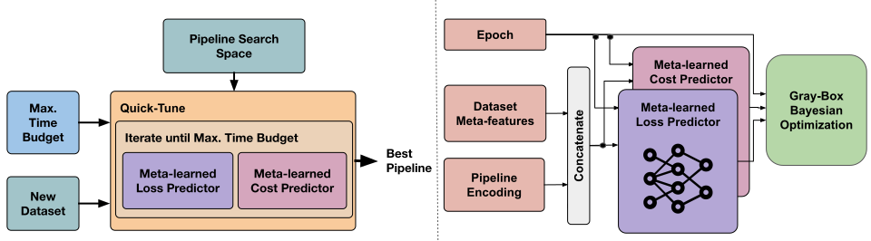

# QuickTune (WIP)
## Quick-Tune: Quickly Learning Which Pre Trained Model to Fine Tune and How [ICLR2024](https://openreview.net/forum?id=tqh1zdXIra)

This repo contains the code for running experiments with QuickTune




## Run QuickTune

### Prepare Environment
To install QuickTune, you can simply use `pip`:
```bash
pip install quicktune
```

This project depends on a custom version of [*timm*](https://github.com/huggingface/pytorch-image-models), which is not available on PyPI. You can install it by running the following command:
```bash
pip install git+https://github.com/rapanti/qt_timm
```

### Download the QuickTune Meta-Dataset:
```bash
wget https://rewind.tf.uni-freiburg.de/index.php/s/oMxC5sfrkA53ESo/download/qt_metadataset.zip
unzip qt_metadataset.zip
```

### Download the metalearned Optimizer
```bash
wget https://rewind.tf.uni-freiburg.de/index.php/s/XBsMjps5n3N9we6/download/mini.pth.tar
```

### Prepare Custom Dataset
The custom dataset must be in Pytorch's [ImageFolder](https://pytorch.org/vision/main/generated/torchvision.datasets.ImageFolder.html) format, e.g. download the Imagenette dataset:
```bash
wget https://s3.amazonaws.com/fast-ai-imageclas/imagenette2-320.tgz
tar -xvzf imagenette2-320.tgz
```

Modify the quicktuning [script](examples/quicktuning.py) in the examples folder to your needs.
